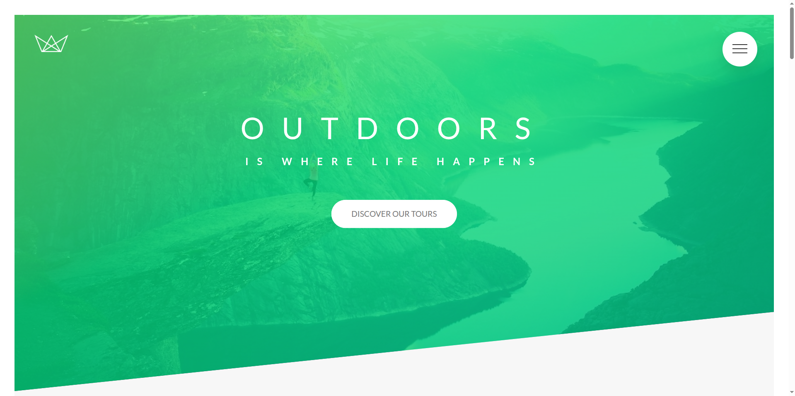
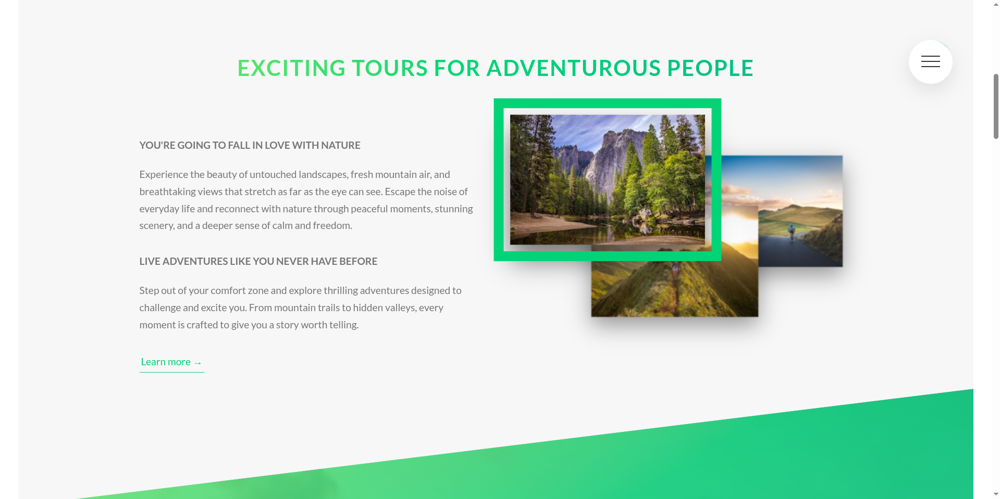
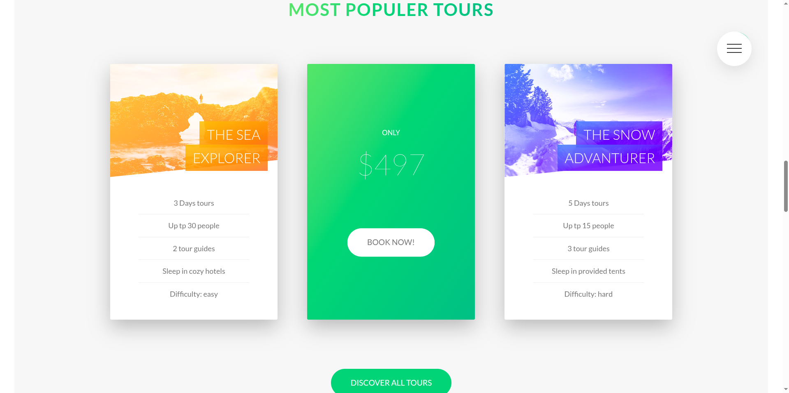
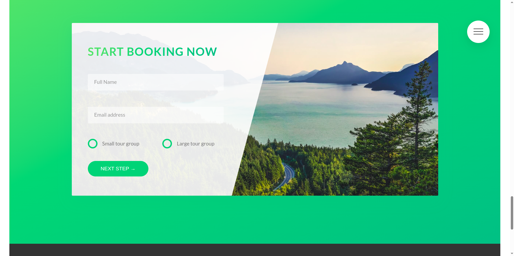
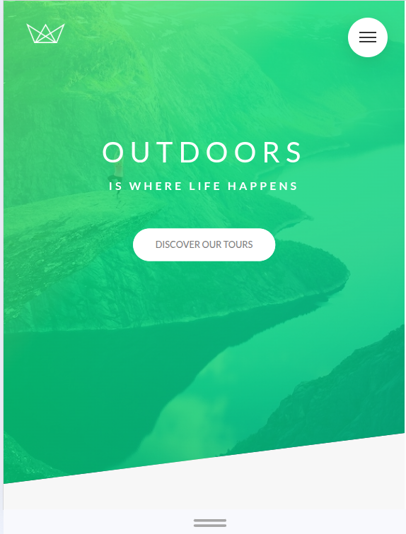
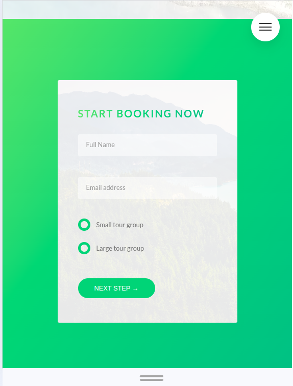
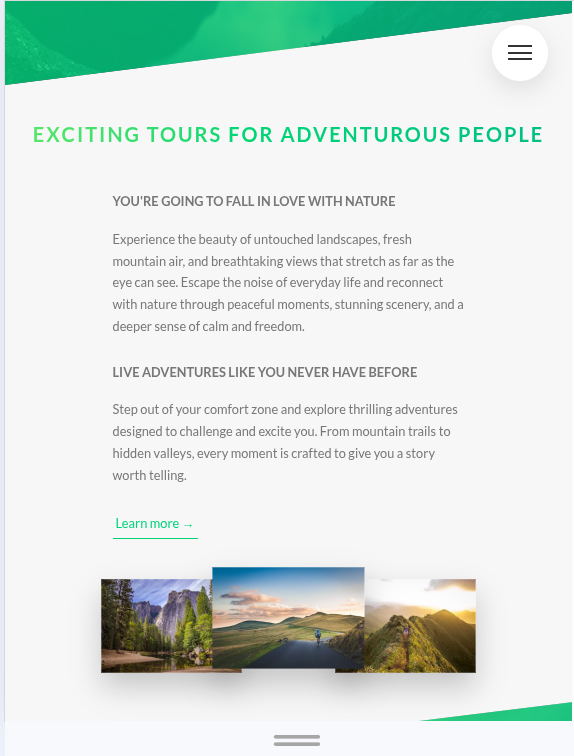
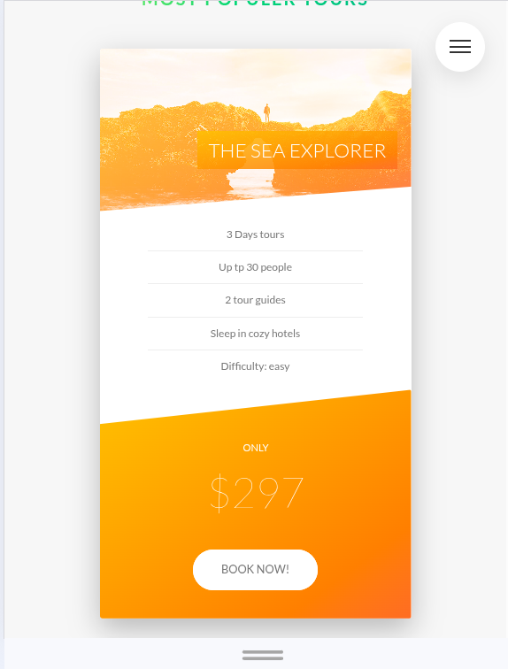

  

  
  
  
  

## NATOURS

Natours is a fictional company for marketing about touring in nature.

This repository was created as a learning space for CSS, with a primary focus on Sass (SCSS). It is part of my journey toward becoming a better Full Stack Developer, especially by strengthening my front-end styling skills.All materials and implementations in this repository are based on courses I have taken on Udemy. This project is strictly for educational purposes and is not intended to claim ownership of any assets, designs, or learning materials related to the original course or the fictional website concept.

The main course used as a learning resource:

- [Advanced CSS and Sass: Flexbox, Grid, Animations and More!](https://www.udemy.com/course/advanced-css-and-sass/?couponCode=CP250105G2)

## Goals

- Learn CSS in more depth
- Use SASS more flexibly and effectively
- Use CSS animations for a better user experience
- Gain experience writing HTML and CSS more professionally

## Thinks I Learned

- Basic animated with `@keyframes` and animation property
- Using pseudo `::after` css property
- css work behind the scene
- Layout Techniques using float and transform
- Using the `:checked` hack for navigation and popup
- Spinning card with `transform` properti
- responsive design: image, font, icon etc
- developer workflow

## Section topics

| Section | Title                                                                    | Notes                                                                   | Status       |
| ------- | ------------------------------------------------------------------------ | ----------------------------------------------------------------------- | ------------ |
| 2       | [Setup and first step](./notes/01-setup-and-first-step/)                 | - Animated properties                                                   | ✅ Completed |
| 3       | [How CSS works](./notes/02-how-css-works/)                               | - css working behind the scenes                                         | ✅ Completed |
| 4       | [Introduction to SASS and NPM](./notes/03-introsuction-to-sass-and-npm/) | - Sass                                                                  | ✅ Completed |
| 5       | [Advanced CSS](./notes/04-advanced-css/)                                 | - button and Layout                                                     | ✅ Completed |
| 6       | [Advanced responsive design](./notes/05-advance-responsive-design/)      | - responsive web design with sass mixins, development workflow, testing | ✅ Completed |

## 👐 Final Thoughts

Alhamdulillah, this project has been a great learning journey. I explored modern CSS techniques, built a clean and stylish introduction using **Sass**, and gained a clearer understanding of a **real-world CSS developer workflow**.

This project is not the end — it’s a foundation. In the future, I plan to:

- Revisit this project to add JavaScript for richer interactivity
- Expand it with new pages to further practice and refine my Sass skills
- Continue improving structure, performance, and maintainability

Every step here brought me closer to writing cleaner, more scalable front-end code. I’m excited to come back stronger and push this project even further 🚀.

## Screenshot of the website

### Desktop

### Mobile

